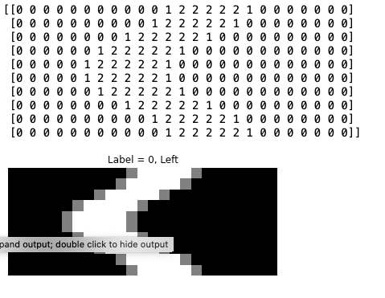
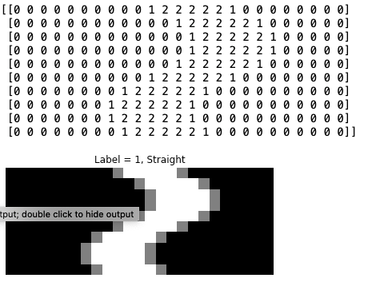
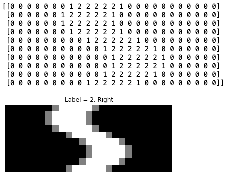
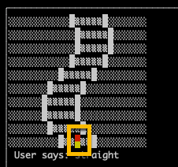

# 8-Bit Autonmous Machine Learning Driving

Your assignment, if you should so choose to accept, is to collect training data from an 8-bit car driving simulator and train a machine learning model to drive the 8-bit car autonously.

Two scripts are provided for you:

* training.py

This script will run the test track for you to use the left/right arrow keys to simulate driving and collect training data.

* drive_by_model.py

This script will look for a file called: `best_driving_model.sav` which assumes you have saved a Scikit-Learn model training on the driving data.

The `drive_by_model.py` will use your model to drive the 8-bit car on a random road.

----

## Setup your environment

This project uses a terminal window package called, `curses` which likely does not work on Windows.  

### Recommended Setup - Docker

if you have Docker installed on your machine the recommended setup is the following:

#### Build a local container that can execute the 8-Bit project

    docker build --tag 8bitdrive .

    docker run -it --rm 8bitdrive /bin/bash

    docker run -it -v /Users/patryan/Development/mygithub/eightbitdriving:/code --rm 8bitdrive /bin/bash

After the run command, you should be in a linux terminal window with a prompt like:

`root@f78503698765:/code#`

Note that the Docker file does expose the current directory to the /code directory in the container so if you choose to use an IDE to edit/create the files locally they will be visible to the container.

### MacOS

The curses library is available in MacOS.  For Mac setups, you can use the following if you do not want to use Docker.

    python3 -m venv venv

    source venv/bin/activate

    pip install -r requirements.txt

The rest of this setup assumes Docker.

## Training Data

The training data is a 150 samples of what the road looked like and the driving instruction.  For example the data for each Left, Right, and Straight would look like the following:

### Left

### Straight

### Right

### Collect the training data

When you start the training, the 'car' is at the bottom of the simulated road and should be in two different colors:

You use your left and right arrow keys to move the car left/right.  No arrow press, means straight.  

You have to allow for a bit of creative visualization in that the car never moves from the center of the area, it is the road the moves.  (Its 8-bit, its simulated)

Assuming you have an open terminal in the running docker container ( see above ) and you are in the /code directory:

.gif)

This will create a file called:  `training.csv`

There are no column headers and the first column is the turning direction:

0 - Left

1 - Straight

2 - Right

## Your Challenge

Create a machine learning model that uses the training.csv data to predict based on the road configuration.

Save your model to a file called, `best_driving_model.sav`

## Test Your Model

To test your model use `drive_by_model.py`.  This script assumes you have saved your models as described above.

Inside the docker container:

`python3 drive_by_model.py`

Select random and see how your model is behaving.

<b>NOTE</b> There is a file called, `model_training.py` which shows just one way to do this.  If you get stuck feel free to use this to help guide your work but try to do it on your own.

